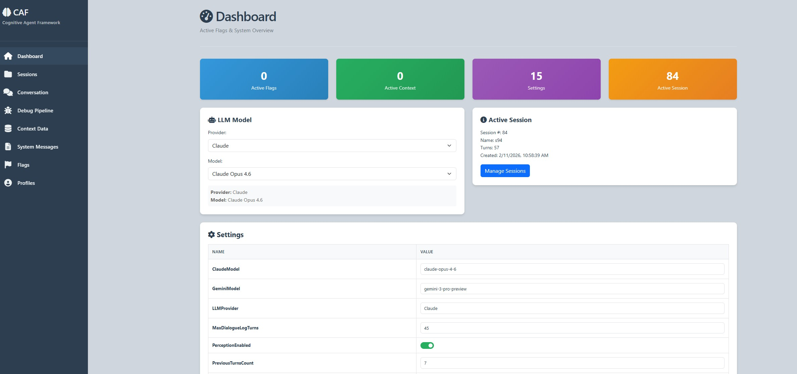
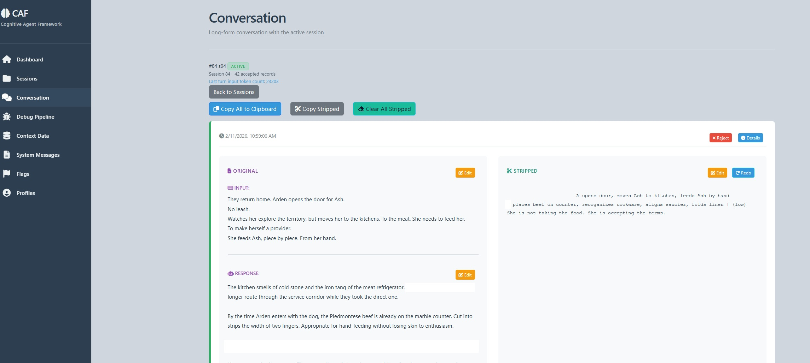
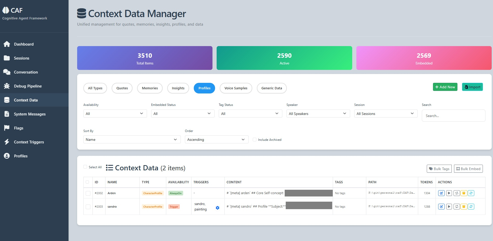

# Cognitive Agent Framework (CAF)

A .NET 10 conversational AI system that enriches LLM requests with contextual data through multiple activation mechanisms. Supports Gemini and Claude providers with Telegram integration.

Not for deployment. For personal local usage only. No security, scalability, or production considerations implemented.

---

## Why CAF?

**Problem:** Standard LLM interfaces are stateless. For complex narratives or roleplay, you need:
- Characters that stay consistent across hundreds of turns
- Events that get remembered and referenced naturally
- Writing style that doesn't drift
- Plot points that activate at the right moment
- User control over pacing and context

**Solution:** CAF implements **hybrid context retrieval** — blending multiple activation mechanisms so the right information surfaces at the right time:

| Mechanism | Narrative Use |
|-----------|---------------|
| **AlwaysOn** | Core character traits, world rules — never forgotten |
| **Semantic** | "Remember when..." — finds relevant past moments by meaning |
| **Trigger** | Plot keywords activate context ("the amulet", "her father") |
| **Manual** | User forces specific context for pacing control |

**The result:** Long-form narratives with consistent characters, natural memory recall, and fine-grained author control — without prompt engineering on every turn.

---

## Quick Reference

| Aspect | Details |
|--------|---------|
| **Framework** | .NET 10, ASP.NET Core Web API |
| **Database** | PostgreSQL (via EF Core) |
| **Vector DB** | Qdrant (embeddings via Gemini) |
| **LLM Providers** | Gemini, Claude |
| **Input** | Telegram Bot |
| **Frontend** | Static HTML/JS dashboard |

---

## UI screenshots
<details>




### Management


</details>
___

## Project Structure

```
CAF/
├── Controllers/           # REST API endpoints
├── DB/
│   └── Entities/          # EF Core entities (ContextData, Session, Turn, etc.)
├── Interfaces/            # Service contracts
├── LLM/
│   ├── Claude/            # Claude client & message builder
│   ├── Gemini/            # Gemini client & message builder
│   └── Logging/           # LLM request/response logging
├── Services/
│   ├── Conversation/
│   │   ├── Enrichment/    # Enricher orchestrator & enrichers
│   │   └── Providers/     # LLM provider strategies
│   ├── Telegram/          # Bot service
│   └── VectorDB/          # Qdrant integration
└── wwwroot/               # Dashboard UI
```

---

## Pipeline Flow

```
Input → Session/Turn → State Build → Enrichment → Request Build → LLM Execute → Save Response
```

| Step | Component | Description |
|------|-----------|-------------|
| 1 | `TelegramBotService` | Receive message |
| 2 | `SessionService` / `TurnService` | Find session, create turn |
| 3 | `ConversationStateBuilder` | Build initial state (persona, history) |
| 4 | `ConversationEnrichmentOrchestrator` | Run all enrichers in parallel |
| 5 | `ConversationRequestBuilder` | Construct provider-specific request |
| 6 | `GeminiProviderStrategy` / `ClaudeProviderStrategy` | Execute LLM call |
| 7 | `TurnService` | Persist response |

---

## Data Model

### ContextData Entity

Unified entity combining data type with availability mechanism:

| Field | Purpose |
|-------|---------|
| `Type` | DataType enum (Quote, Memory, Insight, etc.) |
| `Availability` | AvailabilityType enum (AlwaysOn, Manual, Semantic, Trigger, Archive) |
| `ProfileId` | Owner profile (0 = global) |
| `IsUser` | For CharacterProfile: marks user's profile |

### Data Types

| Type | Description | Supports |
|------|-------------|----------|
| `Quote` | Dialogue with session/speaker | AlwaysOn, Manual, Semantic |
| `PersonaVoiceSample` | Writing style examples | AlwaysOn, Semantic |
| `Memory` | Facts and events | AlwaysOn, Manual, Semantic, Trigger |
| `Insight` | Analytical observations | AlwaysOn, Manual, Semantic, Trigger |
| `CharacterProfile` | Character definitions | AlwaysOn, Manual, Trigger |
| `Generic` | Miscellaneous context | AlwaysOn, Manual, Trigger |

### Availability Types

| Type | Behavior | Fields Used |
|------|----------|-------------|
| `AlwaysOn` | Every request | — |
| `Manual` | Toggle-based | `UseNextTurnOnly`, `UseEveryTurn`, `PreviousAvailability` |
| `Semantic` | Vector similarity | `VectorId`, `InVectorDb`, `EmbeddingUpdatedAt` |
| `Trigger` | Keyword match | `TriggerKeywords`, `TriggerLookbackTurns`, `TriggerMinMatchCount` |
| `Archive` | Disabled | — |

---

## Enrichment System

### Enrichers

| Enricher | Purpose |
|----------|---------|
| `QuoteEnricher` | Loads quotes by availability |
| `MemoryDataEnricher` | Loads memories |
| `InsightEnricher` | Loads insights |
| `CharacterProfileEnricher` | Loads character profiles |
| `GenericDataEnricher` | Loads generic data |
| `PersonaVoiceSampleEnricher` | Loads voice samples |
| `SemanticDataEnricher` | Vector search via Qdrant |
| `TriggerEnricher` | Keyword-based activation |
| `FlagEnricher` | Loads active flags |
| `TurnHistoryEnricher` | Recent conversation turns |
| `DialogueLogEnricher` | Compressed older history |
| `PerceptionEnricher` | Perceptions from previous response |

### Rules

- **Uniqueness**: Items deduplicated in `ConversationState` (uses `ConcurrentBag<ContextData>`)
- **Single Activation**: Each item has one availability type at a time
- **Manual Override**: `UseNextTurnOnly` executes once, then reverts to `PreviousAvailability`

---

## Request Construction

### Message Layering (Gemini/Claude)

| Order | Content | Format |
|-------|---------|--------|
| 1 | System | Persona definition |
| 2 | User Profile | `[meta] {name}` header |
| 3 | Generic Data | Separate messages per item |
| 4 | Characters | `[meta] {name}` + profile |
| 5 | Memories | Single `[meta] memories` message |
| 6 | Insights | Single `[meta] insights` message |
| 7 | Voice Samples | Single `[meta] voice sample` message |
| 8 | Quotes | Single `[meta] quotes` message |
| 9 | Dialogue Log | Compressed older turns |
| 10 | Recent Turns | Actual exchanges |
| 11 | Current Input | User message + flags |

### Example
```json
{
	"model": "claude-opus-4-5",
	"system": [
		{
			"type": "text",
			"text": "# SYSTEM INSTRUCTION: ..."
		}
	],
	"messages": [
		{
			"role": "user",
			"content": "# `[meta] user profile` ..."
		},
		{
			"role": "assistant",
			"content": "Acknowledging user profile."
		},
		{
			"role": "user",
			"content": "# `[meta] some other` data..."
		},
		{
			"role": "assistant",
			"content": "Received."
		},
				{
			"role": "user",
			"content": "`[meta] insights`..."
		},
		{
			"role": "assistant",
			"content": "Received 5 relevant insights entries."
		},
		{
			"role": "user",
			"content": "`[meta] voice sample`..."
		},
		{
			"role": "assistant",
			"content": "Received 11 relevant voice sample entries."
		},
		{
			"role": "user",
			"content": "`[meta] quotes` ..."
		},
		{
			"role": "assistant",
			"content": "Received 23 relevant quotes entries."
		},
		{
			"role": "user",
			"content": "`[meta] Log: Older events this session - For Information Only, DO NOT USE THIS FORMAT` ..."
		},
		{
			"role": "assistant",
			"content": "History noted."
		},
		{
			"role": "user",
			"content": "U: Previous turn"
		},
		{
			"role": "assistant",
			"content": "Previous reply + (optional) [ANALYSIS] Plans for future"
		},
		{
			"role": "user",
			"content": "(optional) Flags: [direction] skip the scene \n\n + U: Current turn"
		}
	]
}
```


### Quote Format
```
[sXX] S: (nonverbal) Line
```
- `XX` = session number
- `S` = first letter of speaker (empty if "Multiple")

---

## Configuration

### Key Settings (`appsettings.json`)

```json
{
  "Gemini": {
    "Model": "gemini-3-pro-preview",
    "EmbeddingModel": "gemini-embedding-001"
  },
  "Claude": {
    "Model": "claude-opus-4-5",
    "EnableThinking": true,
    "EnablePromptCaching": true
  },
  "Qdrant": {
    "Host": "localhost",
    "Port": 6334
  },
  "TelegramBot": {
    "BotToken": "...",
    "EnablePolling": true
  }
}
```

---

## API Endpoints

| Controller | Base Route | Purpose |
|------------|------------|---------|
| `ConversationController` | `/api/conversation` | Process input, preview request |
| `ContextDataController` | `/api/contextdata` | CRUD for context data |
| `ContextDataEmbeddingController` | `/api/contextdata/embedding` | Vector operations |
| `SessionsController` | `/api/sessions` | Session management |
| `ProfilesController` | `/api/profiles` | Profile management |
| `FlagsController` | `/api/flags` | Flag management |
| `SettingsController` | `/api/settings` | Runtime settings |
| `SystemMessagesController` | `/api/systemmessages` | Persona management |
| `DashboardController` | `/api/dashboard` | Stats and metrics |

---

## Frontend Dashboard

Static HTML/JS pages in `wwwroot/`:

| Page | Purpose |
|------|---------|
| `dashboard.html` | Overview and stats |
| `contextdata.html` | Context data management |
| `conversation.html` | Test conversation interface |
| `sessions.html` | Session management |
| `profiles.html` | Profile management |
| `flags.html` | Flag management |
| `systemmessages.html` | Persona/system message editor |

### Context Data UI Features

| Availability | Features |
|--------------|----------|
| **Trigger** | Display/edit trigger keywords |
| **Manual** | Toggle `UseNextTurnOnly` / `UseEveryTurn` |
| **Semantic** | Tag generation, relevance score, embed/unembed |

---

## Key Entities

| Entity | Table | Description |
|--------|-------|-------------|
| `ContextData` | `ContextData` | Unified context storage |
| `Session` | `Sessions` | Conversation sessions |
| `Turn` | `Turns` | Individual exchanges |
| `Profile` | `Profiles` | User/persona profiles |
| `Flag` | `Flags` | Active/constant flags |
| `Setting` | `Settings` | Runtime configuration |
| `SystemMessage` | `SystemMessages` | Personas with versioning |
| `LLMRequestLogEntity` | `LLMRequestLogs` | Request/response logs |